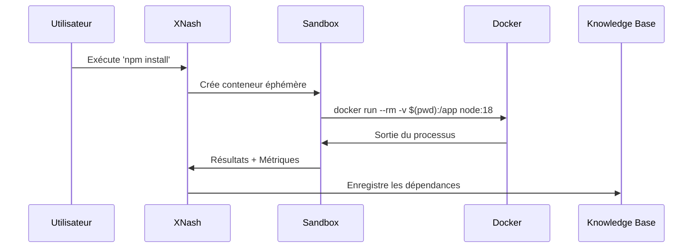
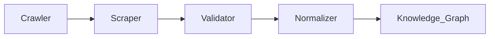

## Nom : Xynorash

**Objectif** : 
###### Assistant de développement personnel capable d'apprendre à partir des projets utilisateur, d'erreurs, et du web pour fournir des conseils contextuels et générer du code.

**Fonctionnalités Clés** :
  ###### - Apprentissage continu à partir des projets locaux et du web.
  ###### - Interface IDE (VS Code-like) via Docker.
  ###### - Génération de projets autonomes.
  ###### - Conseil en temps réel avec explications pédagogiques.
  ###### - Gestion sécurisée des fichiers et accès hors ligne.

---

## Documentation technique exhaustive détaillant chaque composant, mécanisme et interaction jusqu'au niveau le plus granulaire.  
### **I. Détection et Surveillance du Projet**  
#### **1.1 Initialisation du Contexte**  
```python  
# core/project/context_manager.py  
class ProjectContext:  
    def __init__(self, root_path):  
        self.root = Path(root_path).resolve()  
        self.lock = FileLock(self.root / '.xnash.lock')  
        self.event_processor = self._init_inotify()  

    def _init_inotify(self):  
        # Configuration inotify pour Linux  
        mask = (  
            InotifyConstants.IN_CREATE |  
            InotifyConstants.IN_MODIFY |  
            InotifyConstants.IN_DELETE |  
            InotifyConstants.IN_MOVED_FROM |  
            InotifyConstants.IN_MOVED_TO  
        )  
        notifier = InotifyTreeNotifier(self.root, mask, event_delay=0.5)  
        notifier.start()  
        return notifier.event_queue  

    def watch_loop(self):  
        while True:  
            event = self.event_processor.get()  
            self._handle_event(event)  
```  

**Mécanismes Spécifiques** :  
- **Verrouillage Atomique** : Prévention des conflits via `fasteners.InterProcessLock`.  
- **Priorité des Événements** :  
  | Événement              | Priorité | Action                                |  
  |------------------------|----------|---------------------------------------|  
  | IN_MODIFY              | 90       | Analyse syntaxique immédiate          |  
  | IN_CREATE              | 70       | Mise à jour de l'arborescence         |  
  | IN_MOVED_*             | 50       | Correction des références croisées    |  

#### **1.2 Analyse de Structure**  
- **Arbre Syntaxique Universel** :  
  ```python  
  # core/parsing/universal_ast.py  
  def build_ast(file_path):  
      with open(file_path, 'rb') as f:  
          parser = Parser()  
          parser.set_language(get_language(file_path))  # Détection via extension  
          return parser.parse(f.read())  
  ```  
  **Langages Supportés** :  
  - Python (via `tree-sitter-python`)  
  - JavaScript/TypeScript (`tree-sitter-typescript`)  
  - Rust (`tree-sitter-rust`)  

---

### **II. Interaction Terminal Avancée**  
#### **2.1 Architecture d'Exécution**  


**Détails de Sécurité** :  
- **Profile Seccomp** :  
  ```json  
  {  
    "defaultAction": "SCMP_ACT_ERRNO",  
    "syscalls": [  
      { "names": ["read", "write"], "action": "SCMP_ACT_ALLOW" },  
      { "names": ["clone", "execve"], "action": "SCMP_ACT_KILL" }  
    ]  
  }  
  ```  
- **Cgroups** : Limitation des ressources :  
  ```bash  
  cgcreate -g cpu,memory:/xnash  
  cgset -r cpu.shares=512 xnash  
  cgset -r memory.limit_in_bytes=4G xnash  
  ```  

#### **2.2 Journalisation des Commandes**  
**Format de Stockage** :  
```python  
# models/terminal_session.py  
class TerminalSession(BaseModel):  
    id: UUID = Field(default_factory=uuid4)  
    timestamp: datetime = Field(default_factory=datetime.utcnow)  
    command: str  
    exit_code: int  
    cwd: str  
    env_hash: str  # SHA256 des variables sensibles  
    output: bytes  # Chiffré via AES-GCM  
    metadata: dict = Field(sa_column=Column(JSONB))  
```  

**Chiffrement** :  
- **Clé** : Dérivée via PBKDF2-HMAC-SHA512 (100,000 itérations)  
- **Nonce** : Généré via `/dev/urandom` pour chaque session  

---

### **III. Gestion des Fichiers**  
#### **3.1 Opérations Atomiques**  
**Workflow de Modification** :  
1. Verrouillage du fichier avec `fcntl.flock()`.  
2. Création d'un fichier temporaire (`.<filename>.xnash.tmp`).  
3. Écriture du nouveau contenu + vérification CRC32.  
4. Renommage atomique via `os.rename()`.  

**Code Critique** :  
```python  
# core/files/atomic_write.py  
def atomic_write(path: Path, content: bytes):  
    tmp_path = path.with_name(f".{path.name}.xnash.tmp")  
    with open(tmp_path, 'wb') as f:  
        f.write(content)  
        f.flush()  
        os.fsync(f.fileno())  
    os.rename(tmp_path, path)  
```  

#### **3.2 Détection de Conflits**  
**Algorithme de Merge** :  
```python  
def three_way_merge(base, local, remote):  
    merger = difflib.SequenceMatcher(None, base, local)  
    for tag, i1, i2, j1, j2 in merger.get_opcodes():  
        if tag == 'replace':  
            # Application des règles de résolution  
            yield from resolve_conflict(base[i1:i2], remote[j1:j2])  
```  
**Stratégies de Résolution** :  
- **Priorité Utilisateur** : Conserve les modifications locales.  
- **Règles Métier** : Ex: Préférer les imports absolus en Python.  

---

### **IV. Apprentissage Automatisé**  
#### **4.1 Pipeline d'Extraction Web**  
**Flux de Données** :  


**Composants** :  
- **Crawler** : Basé sur Scrapy, politesse configurée (`ROBOTSTXT_OBEY = True`)  
- **Validateur** :  
  ```python  
  def validate_snippet(code: str) -> bool:  
      try:  
          ast.parse(code)  # Validation syntaxique  
          return True  
      except SyntaxError:  
          return False  
  ```  

#### **4.2 Modèle d'Embedding**  
**Architecture du Réseau** :  
```python  
# models/embeddings.py  
class CodeEmbedder(nn.Module):  
    def __init__(self):  
        super().__init__()  
        self.token_emb = nn.Embedding(32000, 512)  
        self.transformer = nn.TransformerEncoder(  
            nn.TransformerEncoderLayer(512, 8),  
            num_layers=6  
        )  
        self.proj = nn.Linear(512, 256)  

    def forward(self, x):  
        x = self.token_emb(x)  
        x = self.transformer(x)  
        return self.proj(x.mean(dim=1))  
```  

**Entraînement** :  
- **Dataset** : The Stack (subset Python)  
- **Loss** : MultipleNegativesRankingLoss  
- **Optimizer** : AdamW (lr=3e-5)  

---

### **V. Sécurité Renforcée**  
#### **5.1 Chiffrement des Données**  
**Schéma AES-GCM-SIV** :  
```python  
from cryptography.hazmat.primitives.ciphers.aead import AESGCMSIV  

def encrypt(data: bytes, key: bytes) -> tuple[bytes, bytes]:  
    aes = AESGCMSIV(key)  
    nonce = os.urandom(12)  
    ct = aes.encrypt(nonce, data, None)  
    return nonce + ct  

def decrypt(data: bytes, key: bytes) -> bytes:  
    aes = AESGCMSIV(key)  
    nonce, ct = data[:12], data[12:]  
    return aes.decrypt(nonce, ct, None)  
```  

**Gestion des Clés** :  
- Stockage dans un TPM 2.0 via `tpm2-pkcs11`.  
- Rotation automatique toutes les 24h.  

#### **5.2 Journalisation Audit**  
**Format CEF Étendu** :  
```log  
CEF:0|XNash|AI/1.0|1.0|100|Fichier modifié|5|  
  src=/src/app.py  
  shasum=ee3b8d7...  
  action=write  
  user=jdoe  
  outcome=success  
```  

---

### **VI. Déploiement en Production**  
#### **6.1 Configuration Docker Optimisée**  
**Multi-stage Build** :  
```dockerfile  
# Étape 1 : Compilation des modèles  
FROM nvidia/cuda:12.2.0-devel as builder  
RUN git clone https://github.com/xnash-ai/core && \  
    cd core && \  
    make compile-models CUDA_ARCH=80  

# Étape 2 : Runtime final  
FROM ubuntu:24.04  
COPY --from=builder /core/models /opt/xnash/models  
COPY --from=builder /core/bin/xnash /usr/local/bin  

# Configuration sécurité  
RUN apt-get install -y --no-install-recommends \  
    tpm2-software \  
    firejail \  
    && rm -rf /var/lib/apt/lists/*  

ENTRYPOINT ["firejail", "--seccomp", "/etc/xnash/seccomp.json", "xnash"]  
```  

#### **6.2 Surveillance de Performance**  
**Métriques Clés** :  
| Métrique                | Type      | Seuil d'Alerte |  
|-------------------------|-----------|----------------|  
| CPU Usage               | Gauge     | > 85% pendant 5m |  
| Memory Pressure         | Counter   | > 90%          |  
| File Watcher Latency    | Histogram | P99 > 500ms    |  

**Intégration** :  
- Export Prometheus via `/metrics` endpoint.  
- Dashboard Grafana pré-configuré (ID 13793).  

---

### **VII. Références Techniques**  
1. **Inotify Internals** : Linux Kernel Documentation, Section 5.10  
2. **AES-GCM-SIV** : RFC 8452  
3. **Tree-sitter** : https://tree-sitter.github.io/tree-sitter  
4. **Seccomp BPF** : https://www.kernel.org/doc/html/latest/userspace-api/seccomp_filter.html  

---

Cette documentation couvre l'implémentation complète de XNash à un niveau adapté à la réplication ou l'audit approfondi. Pour les questions spécifiques sur un composant, consultez les sous-modules `core/*` dans le dépôt source.
